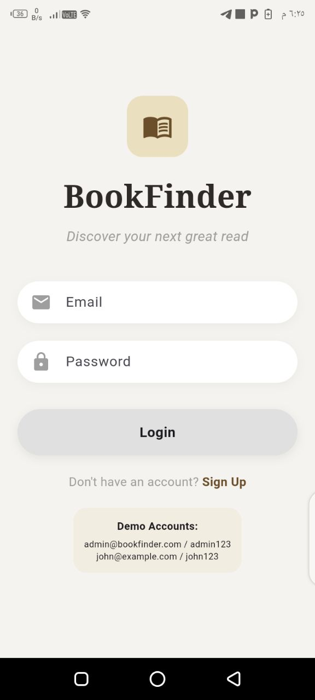
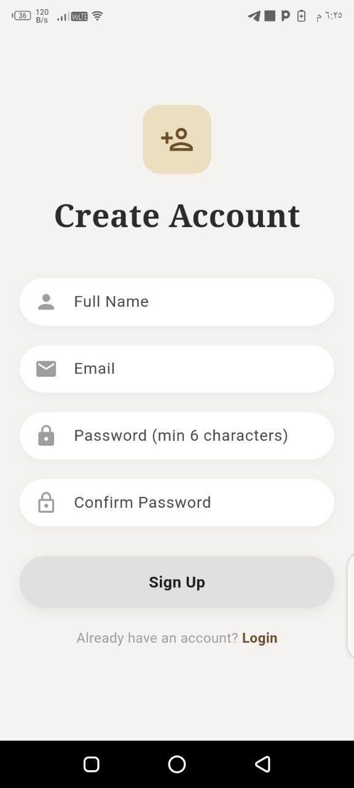
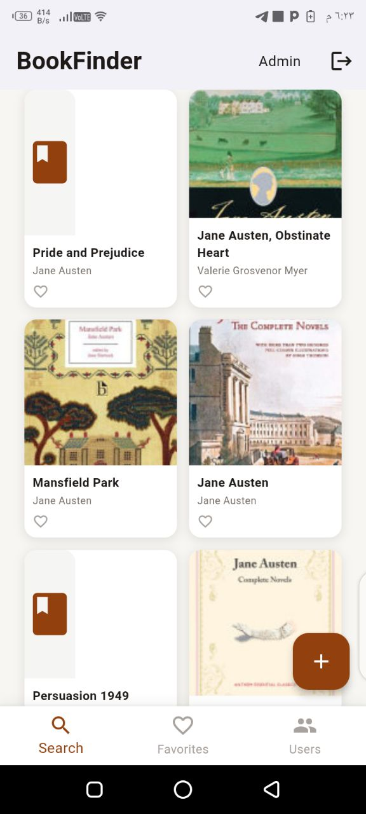
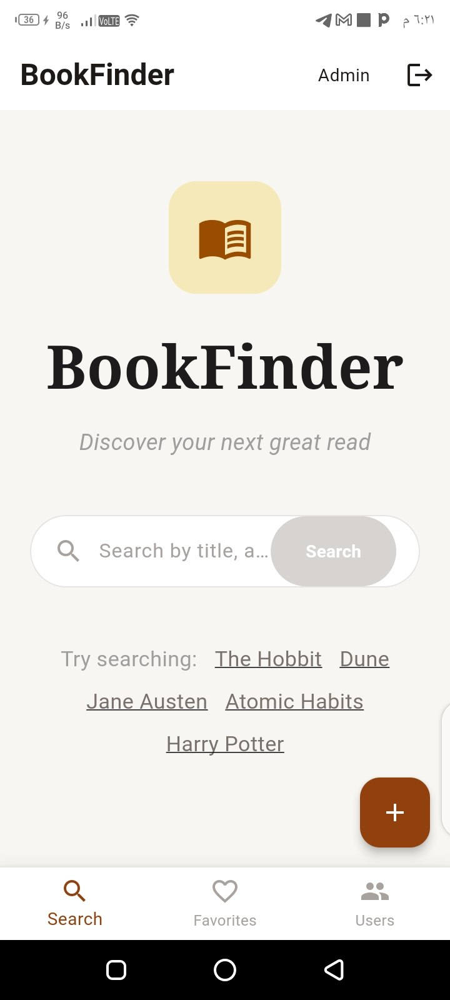
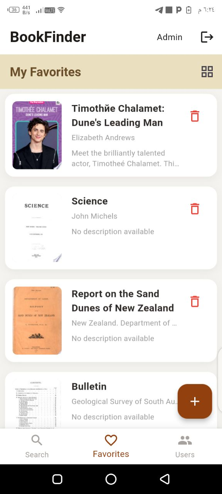
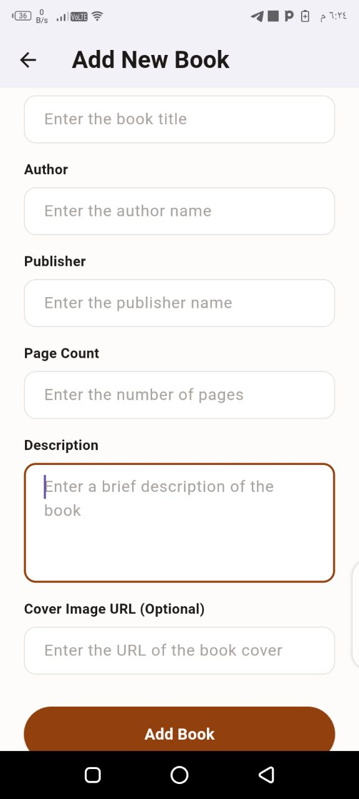
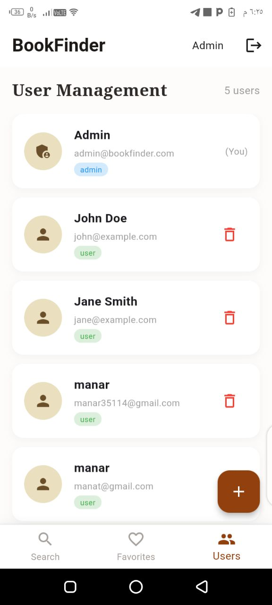

# 📚 Books App

A Flutter-based mobile application for discovering, searching, and managing books in an easy and user-friendly way.

## ✨ Features

- 🔐 User Registration & Login
- 📚 Browse and discover books
- 🔎 Search for books using an external API
- 📖 View detailed information about each book
- ❤️ Add and manage favorite books
- ➕ Add books
- 👤 Manage user information
- 🔥 Firebase integration
- 💾 Local data storage
- 📱 Responsive and user-friendly Flutter UI

## 🛠️ Technologies Used

- **Flutter**
- **Dart**
- **Firebase**
- **REST API**
- **HTTP Requests**
- **Local Storage**
- **Material Design**

## 🔌 API Integration

The application integrates with an external Books API to retrieve book information dynamically.

Users can search for books and view information such as:

- Book title
- Author
- Description
- Cover image
- Other available book details

API configuration and sensitive credentials are kept outside the public repository using environment variables.

## 🔥 Firebase

Firebase is used to support application functionality such as:

- User authentication
- User data management
- Application backend services

Sensitive Firebase configuration files are excluded from the public repository.

## 📱 Main Screens

## 📸 App Screenshots

<p align="center">
  
  
  
  
</p>

<p align="center">
  
  
  
  
</p>
- Login Screen
- Register Screen
- Home Screen
- Search Screen
- Book Details Screen
- Favorites Screen
- Add Book Screen
- Users Screen

## 📂 Project Structure

```text
lib/
├── add_book_screen.dart
├── api_service.dart
├── book.dart
├── book_detail_screen.dart
├── favorites_screen.dart
├── firebase_options.dart
├── firebase_service.dart
├── home_screen.dart
├── local_storage.dart
├── login_screen.dart
├── main.dart
├── register_screen.dart
├── results.dart
├── search_screen.dart
├── user.dart
└── users_screen.dart
```

⚙️ Getting Started
Prerequisites

Make sure you have installed:

Flutter SDK
Dart SDK
Android Studio or VS Code
Android device or emulator
Installation

Clone the repository:
git clone https://github.com/manar3482/books_app.git

Navigate to the project directory:
cd books_app

Install dependencies:
flutter pub get

Configure your environment variables and Firebase settings locally.

Then run the application:
flutter run
🔐 Security

Sensitive configuration files and API credentials are not included in the public repository.

The project uses .gitignore to prevent sensitive files such as .env from being uploaded.

👩‍💻 Developer

Manar Alaa

walaa mahmoud

GitHub: @manar3482

📌 Project Status

Completed Flutter application developed as an academic project.

⭐ If you find this project useful, feel free to explore the repository.
